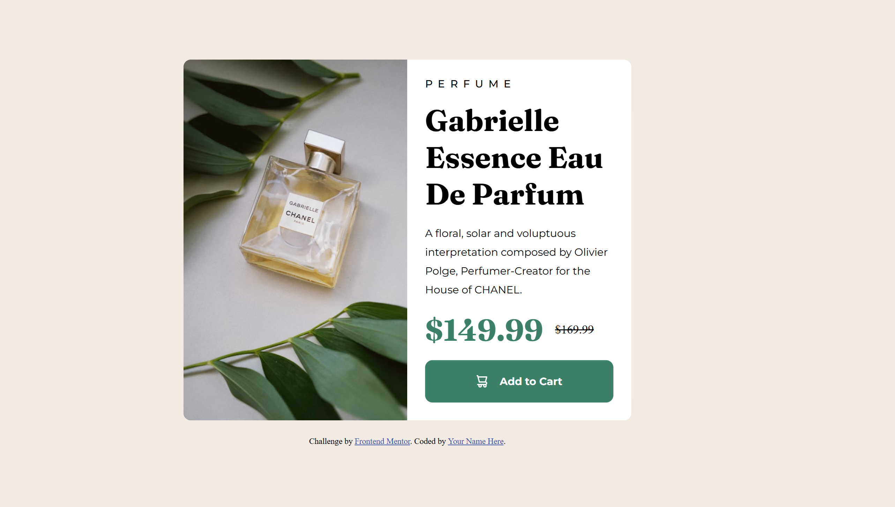
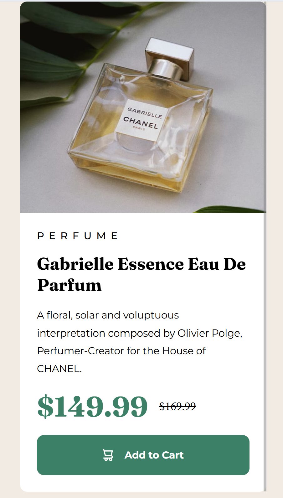

# Frontend Mentor - Product preview card component solution

This is a solution to the [Product preview card component challenge on Frontend Mentor](https://www.frontendmentor.io/challenges/product-preview-card-component-GO7UmttRfa). Frontend Mentor challenges help you improve your coding skills by building realistic projects. 

## Table of contents

- [Overview](#overview)
  - [The challenge](#the-challenge)
  - [Screenshot](#screenshot)
  - [Links](#links)
- [My process](#my-process)
  - [Built with](#built-with)
  - [What I learned](#what-i-learned)
  - [Continued development](#continued-development)
- [Author](#author)


## Overview

### The challenge

Users should be able to:

- View the optimal layout depending on their device's screen size
- See hover and focus states for interactive elements

### Screenshot

#### Desktop Version


#### Mobile Version



### Links

- Solution URL: [Add solution URL here](https://github.com/Matthew-Flint/Product-Preview-Card-Component)
- Live Site URL: [Add live site URL here](https://matthew-flint.github.io/Product-Preview-Card-Component/)

## My process

### Built with

- Semantic HTML5 markup
- CSS custom properties
- Flexbox
- Media Queries for Responsive Design

### What I learned

This was more challenging than my previous projects as I had to get the image to change to a completely different source when the screen reached a certain size. I ended up styling the mobile image to disappear by default and then turn it back on with the desktop one turned off usiong a media query, like this: 

```css
.image-desktop {
    width: 50%;
    height: auto; 
} 
.image-mobile {
    display: none;
}
@media screen and (max-width: 620px) {
    .image-desktop {
        display: none;
    }
    .image-mobile {
        display: inline-block;
        height: 300px;
    }
}
```

### Continued development

I'm still working out em and rem but I was at least able to use them in a way that didn't cause a whole lot of parent/child problems - I was careful not to use em in spots where they would inherit the previously used em of a parent container. 

Width percentage was also a challenge and I'm still not sure I went about changing the image size in the most efficient way possible.

**Note: Delete this note and the content within this section and replace with your own plans for continued development.**


## Author

- Website - [Add your name here](https://matthew-flint.github.io/Product-Preview-Card-Component/)
- Frontend Mentor - [@yourusername](https://www.frontendmentor.io/profile/Matthew-Flint)
